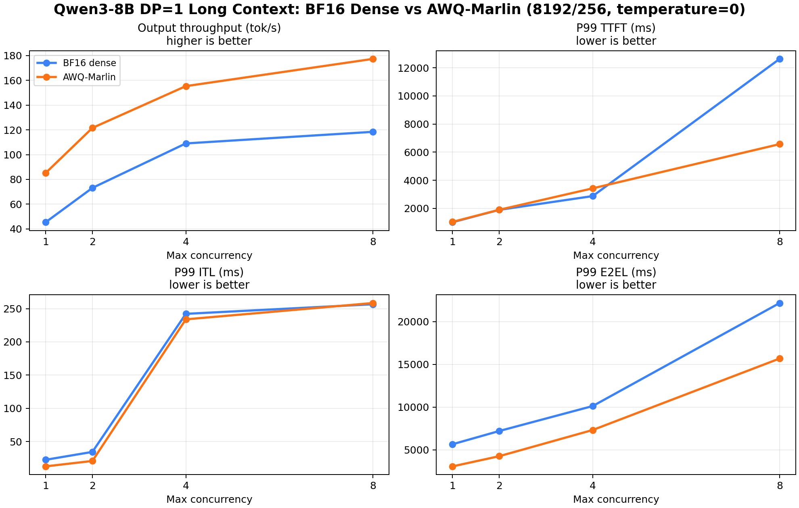

# AWQ-Marlin DP=1 Long-Context A/B

## Purpose

This experiment compares the dense BF16 `Baseline A-LC` against an AWQ-Marlin weight-quantized variant under the same `DP=1` long-context serving workload.

The goal is to check whether AWQ-Marlin still helps when the workload becomes prefill-heavy and KV-cache pressure becomes more visible.

## Setup

| Item | BF16 Baseline A-LC | AWQ-Marlin LC |
|---|---|---|
| Model | `Qwen3-8B` | `Qwen3-8B-AWQ` |
| Served model name | `Qwen3-8B` | `Qwen3-8B-AWQ-Marlin` |
| GPU | single `NVIDIA GeForce RTX 4090` | single `NVIDIA GeForce RTX 4090` |
| Serving stack | `vLLM` | `vLLM` |
| Parallelism | `TP=1`, `DP=1` | `TP=1`, `DP=1` |
| dtype | `bfloat16` | `half` |
| Quantization | none | `awq_marlin` |
| Prompt / output | `8192 / 256` tokens | `8192 / 256` tokens |
| Prompts | `128` | `128` |
| Arrival | burst, `request_rate=inf` | burst, `request_rate=inf` |
| Max concurrency | `1 / 2 / 4 / 8` | `1 / 2 / 4 / 8` |
| Seed / temperature | `42 / 0` | `42 / 0` |

Benchmark command:

```bash
MODEL_CONFIG=configs/qwen3_8b_awq_marlin.yaml \
RESULT_DIR=results/tables/Qwen3-8B/awq_marlin_dp1_long_context \
CONCURRENCIES="1 2 4 8" \
RANDOM_INPUT_LEN=8192 \
RANDOM_OUTPUT_LEN=256 \
NUM_PROMPTS=128 \
SEED=42 \
TEMPERATURE=0 \
bash scripts/run_vllm_bench_concurrency.sh
```

## Result Summary

| Max concurrency | BF16 out tok/s | AWQ out tok/s | AWQ throughput delta | BF16 P99 TTFT ms | AWQ P99 TTFT ms | TTFT delta | BF16 P99 ITL ms | AWQ P99 ITL ms | ITL delta | BF16 P99 E2EL ms | AWQ P99 E2EL ms | E2EL delta |
|---:|---:|---:|---:|---:|---:|---:|---:|---:|---:|---:|---:|---:|
| 1 | 45.40 | 85.18 | +87.6% | 1012.78 | 1037.45 | +2.4% | 22.49 | 12.59 | -44.0% | 5660.96 | 3070.23 | -45.8% |
| 2 | 73.13 | 121.57 | +66.2% | 1895.94 | 1899.62 | +0.2% | 34.36 | 20.73 | -39.7% | 7208.92 | 4261.58 | -40.9% |
| 4 | 109.05 | 155.33 | +42.4% | 2873.78 | 3424.99 | +19.2% | 242.18 | 233.90 | -3.4% | 10129.34 | 7326.18 | -27.7% |
| 8 | 118.42 | 177.31 | +49.7% | 12631.63 | 6570.52 | -48.0% | 256.62 | 258.44 | +0.7% | 22183.35 | 15688.89 | -29.3% |



## KV / Scheduler Metrics

The original BF16 A-LC performance run did not include `c*_metrics.prom`. For KV-cache comparison, the BF16 side below uses the later `baseline_a_dp1_long_context_metrics64` run with the same serving configuration and `NUM_PROMPTS=64`.

| Max concurrency | BF16 num GPU blocks | AWQ num GPU blocks | BF16 max KV usage % | AWQ max KV usage % | BF16 max running/waiting | AWQ max running/waiting |
|---:|---:|---:|---:|---:|---:|---:|
| 1 | 2985 | 6279 | 17.69 | 8.41 | 1 / 0 | 1 / 0 |
| 2 | 2985 | 6279 | 35.39 | 16.82 | 2 / 1 | 2 / 1 |
| 4 | 2985 | 6279 | 70.74 | 33.63 | 4 / 3 | 4 / 3 |
| 8 | 2985 | 6279 | 88.44 | 67.19 | 5 / 7 | 8 / 6 |

## Observations

- AWQ-Marlin improves long-context output throughput at every concurrency point, from `+42.4%` to `+87.6%`.
- The gain is still strong, but smaller than the short-context case. This is expected: long-context requests spend more time in prefill and scheduler admission, where weight-only quantization is not as dominant as decode-side weight bandwidth.
- At c=1 and c=2, AWQ-Marlin strongly reduces P99 ITL and P99 E2EL while keeping TTFT essentially flat. In these lower-pressure long-context points, serving-level ITL is still consistent with a faster decode path.
- At c=4, AWQ-Marlin improves throughput and E2EL, but P99 TTFT worsens by `+19.2%` and P99 ITL only improves by `3.4%`. This does not support a clean end-to-end decode-latency win at this load point.
- At c=8, AWQ-Marlin reduces P99 TTFT by `48.0%` and improves E2EL by `29.3%`, but P99 ITL is roughly unchanged. At this point, tail ITL is likely dominated by long-context scheduling, chunked prefill interleaving, and KV residency pressure rather than pure decode GEMM speed.
- AWQ-Marlin increases the KV block budget from `2985` to `6279` blocks. This is the memory-side benefit of weight quantization: weights occupy less VRAM, so vLLM can reserve more room for KV cache.
- At c=8, BF16 only reaches `5` max running requests with `7` waiting in the supplemental metrics run, while AWQ reaches `8` running with `6` waiting. This is consistent with AWQ allowing more long-context requests to reside in KV cache at once.

## Interpretation

For the `DP=1` long-context track, AWQ-Marlin remains a clear throughput and E2E-latency improvement, but the bottleneck story is more mixed than the short-context case.

Short-context AWQ was mostly a decode bandwidth win:

```text
P99 ITL down sharply, TTFT mostly unchanged.
```

Long-context AWQ has two observed effects:

```text
1. At lower concurrency, serving-level ITL indicates a faster decode path.
2. Weight memory drops, increasing the available KV block budget.
```

However, at higher long-context concurrency, TTFT and ITL are increasingly shaped by prefill admission, chunked prefill behavior, scheduler capacity, and KV residency. This is why c=4 and c=8 do not show a simple monotonic ITL improvement. In those points, better output throughput and E2EL show a system-level gain, but P99 ITL alone should not be interpreted as proof that the serving-level decode interval improved.

The practical conclusion is:

```text
AWQ-Marlin helps long-context serving, but long-context bottlenecks are no longer only weight-bandwidth-bound. The next A/B should test KV cache FP8 on top of the long-context branch.
```

## Artifacts

- Raw AWQ LC benchmark JSON/log/dmon/metrics files: `results/tables/Qwen3-8B/awq_marlin_dp1_long_context/`
- Comparison summary JSON: `results/tables/Qwen3-8B/awq_marlin_dp1_long_context/awq_marlin_dp1_long_context_vs_baseline_a_lc_summary.json`
- Figure: `benchmark/projects/qwen3_8b_dense/assets/awq_marlin_dp1_long_context_vs_baseline_a_lc.png`
- BF16 reference: `benchmark/projects/qwen3_8b_dense/baseline_a_dp1_long_context.md`
- BF16 KV metrics supplement: `results/tables/Qwen3-8B/baseline_a_dp1_long_context_metrics64/`
