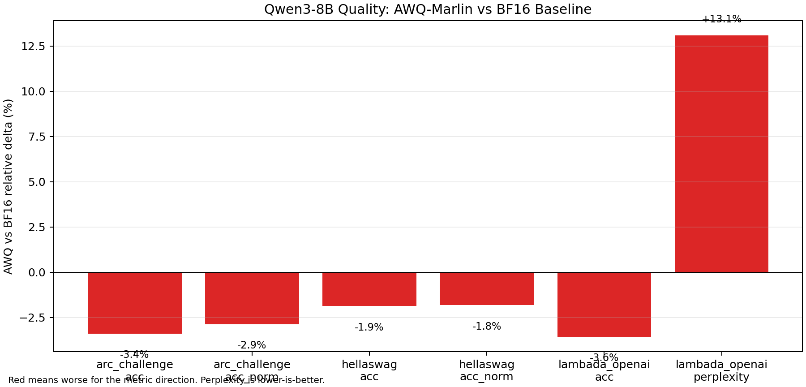

# AWQ-Marlin DP=1 Quality A/B

## Purpose

This report compares the BF16 `DP=1` quality baseline against the AWQ-Marlin weight-quantized model.

The performance result for AWQ-Marlin is strong, but quantization should not be treated as free. This quality run checks whether the speedup comes with measurable task-level regression.

## Setup

| Item | BF16 Baseline | AWQ-Marlin |
|---|---|---|
| Model | `Qwen3-8B` | `Qwen3-8B-AWQ` |
| Evaluation stack | `lm_eval` + `vLLM` | `lm_eval` + `vLLM` |
| Parallelism | `TP=1`, `DP=1` | `TP=1`, `DP=1` |
| dtype | `bfloat16` | `half` |
| Quantization | none | `awq_marlin` |
| `max_model_len` | `10000` | `10000` |
| `gpu_memory_utilization` | `0.85` | `0.85` |
| Prefix caching | enabled | enabled |
| Chunked prefill | enabled | enabled |
| Batch size | `auto` | `auto` |
| Few-shot | `0-shot` | `0-shot` |

AWQ command:

```bash
lm_eval --model vllm \
  --model_args pretrained=/home/xuliren/repo/models/Qwen/Qwen3-8B-AWQ,tensor_parallel_size=1,data_parallel_size=1,dtype=half,quantization=awq_marlin,max_model_len=10000,gpu_memory_utilization=0.85,enable_prefix_caching=True,enable_chunked_prefill=True \
  --tasks lambada_openai,hellaswag,arc_challenge \
  --batch_size auto \
  --output_path results/eval/qwen3_8b/awq_marlin_dp1/results.json \
  --log_samples \
  2>&1 | tee results/eval/qwen3_8b/awq_marlin_dp1/run.log
```

## Results

| Task | Metric | BF16 | AWQ-Marlin | Delta | Relative delta | Combined stderr | Delta / stderr |
|---|---:|---:|---:|---:|---:|---:|---:|
| `arc_challenge` | `acc` | `0.5555` | `0.5367` | `-0.0188` | `-3.38%` | `0.0206` | `-0.91` |
| `arc_challenge` | `acc_norm` | `0.5640` | `0.5478` | `-0.0162` | `-2.87%` | `0.0205` | `-0.79` |
| `hellaswag` | `acc` | `0.5716` | `0.5609` | `-0.0107` | `-1.86%` | `0.0070` | `-1.52` |
| `hellaswag` | `acc_norm` | `0.7496` | `0.7359` | `-0.0136` | `-1.82%` | `0.0062` | `-2.21` |
| `lambada_openai` | `acc` | `0.6497` | `0.6266` | `-0.0231` | `-3.55%` | `0.0095` | `-2.44` |
| `lambada_openai` | `perplexity` | `4.5944` | `5.1956` | `+0.6012` | `+13.09%` | `0.2162` | `+2.78` |



## Interpretation

AWQ-Marlin is not quality-neutral on this task set.

- `arc_challenge` drops are within roughly one combined stderr, so they are not very conclusive.
- `hellaswag acc_norm` drops by `1.36` absolute points and about `2.21x` combined stderr.
- `lambada_openai acc` drops by `2.31` absolute points and about `2.44x` combined stderr.
- `lambada_openai perplexity` worsens by `13.09%`, about `2.78x` combined stderr.

This means the current AWQ-Marlin checkpoint gives a strong serving-performance win, but with a measurable quality trade-off.

## Performance / Quality Trade-Off

The serving benchmark showed:

```text
Short-context output throughput: +95.1% to +148.1%
Long-context output throughput:  +42.4% to +87.6%
```

The quality benchmark shows:

```text
HellaSwag acc_norm:      -1.82% relative
LAMBADA accuracy:        -3.55% relative
LAMBADA perplexity:     +13.09% relative, lower is better
```

So the current conclusion should be framed as:

```text
AWQ-Marlin substantially improves throughput and decode latency, but it is not lossless on the current quality suite.
```

## Mitigation Ideas

If this quality drop is unacceptable, the next steps are:

- Recalibrate AWQ with workload-matched data instead of relying on a generic quantized checkpoint.
- Keep sensitive modules in higher precision, especially `lm_head`, embeddings, or selected attention / MLP projections.
- Try a less aggressive quantization path such as INT8 or FP8 weight formats.
- Add domain-specific quality tasks, especially if the deployment target is RAG or long-document QA.
- Use task-level regression thresholds before accepting a quantized serving configuration.

## Artifacts

- BF16 result JSON: `results/eval/qwen3_8b/baseline_a_dp1_bf16/results_2026-05-11T23-20-17.119348.json`
- AWQ result JSON: `results/eval/qwen3_8b/awq_marlin_dp1/results_2026-05-12T21-07-58.800314.json`
- Curated comparison JSON: `benchmark/projects/qwen3_8b_dense/data/awq_marlin_dp1_quality_vs_bf16.json`
- Figure: `benchmark/projects/qwen3_8b_dense/assets/awq_marlin_dp1_quality_vs_bf16.png`
