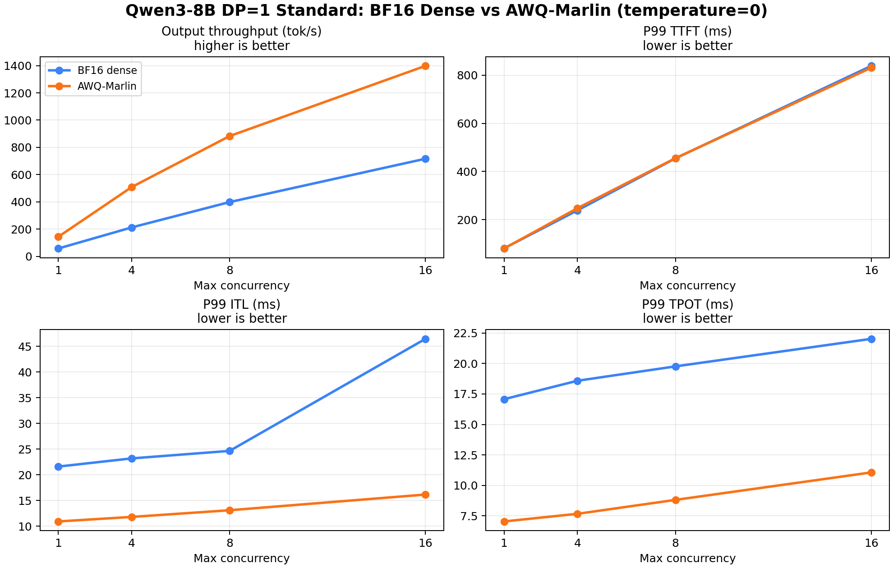

# AWQ-Marlin DP=1 Standard A/B

## Purpose

This experiment compares the dense BF16 `Baseline A` against an AWQ-Marlin weight-quantized variant under the same `DP=1` short-context serving workload.

The goal is to answer whether weight quantization improves serving throughput and decode latency without changing the serving scenario.

## Setup

| Item | BF16 Baseline A | AWQ-Marlin |
|---|---|---|
| Model | `Qwen3-8B` | `Qwen3-8B-AWQ` |
| Served model name | `Qwen3-8B` | `Qwen3-8B-AWQ-Marlin` |
| GPU | single `NVIDIA GeForce RTX 4090` | single `NVIDIA GeForce RTX 4090` |
| Serving stack | `vLLM` | `vLLM` |
| Parallelism | `TP=1`, `DP=1` | `TP=1`, `DP=1` |
| dtype | `bfloat16` | `half` |
| Quantization | none | `awq_marlin` |
| Prompt / output | `512 / 256` tokens | `512 / 256` tokens |
| Prompts | `256` | `256` |
| Arrival | burst, `request_rate=inf` | burst, `request_rate=inf` |
| Max concurrency | `1 / 4 / 8 / 16` | `1 / 4 / 8 / 16` |
| Seed / temperature | `42 / 0` | `42 / 0` |

AWQ-Marlin server command:

```bash
vllm serve /home/xuliren/repo/models/Qwen/Qwen3-8B-AWQ \
  --served-model-name Qwen3-8B-AWQ-Marlin \
  --dtype half \
  --quantization awq_marlin \
  --max-model-len 10000 \
  --gpu-memory-utilization 0.85 \
  --max-num-seqs 64 \
  --enable-prefix-caching \
  --enable-chunked-prefill
```

Benchmark command:

```bash
MODEL_CONFIG=configs/qwen3_8b_awq_marlin.yaml \
RESULT_DIR=results/tables/Qwen3-8B/awq_marlin_dp1_standard \
CONCURRENCIES="1 4 8 16" \
RANDOM_INPUT_LEN=512 \
RANDOM_OUTPUT_LEN=256 \
NUM_PROMPTS=256 \
SEED=42 \
TEMPERATURE=0 \
bash scripts/run_vllm_bench_concurrency.sh
```

## Result Summary

| Max concurrency | BF16 out tok/s | AWQ out tok/s | AWQ throughput delta | BF16 P99 TTFT ms | AWQ P99 TTFT ms | TTFT delta | BF16 P99 ITL ms | AWQ P99 ITL ms | ITL delta | AWQ max KV usage % | AWQ max waiting |
|---:|---:|---:|---:|---:|---:|---:|---:|---:|---:|---:|---:|
| 1 | 57.90 | 143.67 | +148.1% | 80.47 | 79.65 | -1.0% | 21.61 | 10.93 | -49.4% | 0.76 | 0 |
| 4 | 212.49 | 508.80 | +139.4% | 238.33 | 247.37 | +3.8% | 23.20 | 11.81 | -49.1% | 3.06 | 0 |
| 8 | 398.60 | 883.12 | +121.6% | 454.29 | 455.15 | +0.2% | 24.66 | 13.11 | -46.8% | 6.12 | 3 |
| 16 | 716.73 | 1398.03 | +95.1% | 838.85 | 831.14 | -0.9% | 46.46 | 16.17 | -65.2% | 12.14 | 5 |



## Observations

- AWQ-Marlin improves output throughput at every concurrency point, from `+95.1%` to `+148.1%`.
- The strongest gain is on token generation latency: P99 ITL is reduced by roughly `46.8%` to `65.2%`.
- P99 TTFT is essentially neutral. It is within a small band from `-1.0%` to `+3.8%`, which is expected because this workload's prefill length is only `512` tokens and TTFT includes scheduling/admission effects.
- At concurrency `16`, AWQ-Marlin reaches `1398.03 output tok/s`, compared with BF16's `716.73 output tok/s`.
- AWQ-Marlin uses only `12.14%` max KV cache at concurrency `16`, so this short-context workload is not KV-capacity limited.
- Waiting still appears at higher concurrency (`3` at c=8, `5` at c=16), but the wait is not caused by KV capacity exhaustion. It is more likely scheduler token-budget / batch-admission pressure during burst arrival.

## Interpretation

For the `DP=1` short-context serving track, AWQ-Marlin is a clear performance win. The improvement is concentrated in decode throughput and inter-token latency, which is exactly the expected direction for weight-only quantization with a faster Marlin backend.

This result should be treated as the formal `temperature=0` A/B comparison. An earlier exploratory AWQ run with default temperature is preserved separately under:

```text
results/tables/Qwen3-8B/awq_marlin_dp1_standard_temp_default/
```

The exploratory run showed nearly the same trend, but the formal comparison uses the fixed `temperature=0` setup to match Baseline A.

## Artifacts

- Raw AWQ benchmark JSON/log/dmon/metrics files: `results/tables/Qwen3-8B/awq_marlin_dp1_standard/`
- Comparison summary JSON: `results/tables/Qwen3-8B/awq_marlin_dp1_standard/awq_marlin_dp1_standard_vs_baseline_a_summary.json`
- Figure: `benchmark/projects/qwen3_8b_dense/assets/awq_marlin_dp1_standard_vs_baseline_a.png`
- BF16 reference: `benchmark/projects/qwen3_8b_dense/baseline_a_dp1_standard.md`
