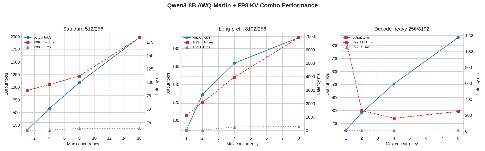

# AWQ-Marlin + FP8 KV Combo Performance

## Purpose

This experiment combines the two strongest single-GPU optimizations observed so far: AWQ-Marlin weight quantization and FP8 KV cache.

The hypothesis is that the two optimizations are complementary: AWQ reduces weight bandwidth during decode, while FP8 KV increases KV residency/admission capacity.

## Setup

| Item | Value |
|---|---|
| Model | `Qwen3-8B-AWQ` |
| GPU | single `NVIDIA GeForce RTX 4090` |
| Serving stack | `vLLM` |
| Quantization | `awq_marlin` |
| KV cache dtype | `fp8` |
| Attention backend | `TRITON_ATTN` |
| dtype | `half` |
| GPU memory utilization | `0.95` |
| TP / DP | `1 / 1` |

Note: older AWQ-only runs used `gpu_memory_utilization=0.85` and default attention backend. Therefore, AWQ-only comparisons are useful directionally but are not a perfectly controlled one-variable A/B. FP8-only comparisons are cleaner for Triton/FP8 settings.

## Combo Results

### Standard serving: 512 input / 256 output

| c | Output tok/s | P99 TTFT | P99 ITL | KV usage | Running/waiting |
|---:|---:|---:|---:|---:|---:|
| 1 | 149.53 | 84.60 ms | 10.67 ms | 0.35% | 1 / 0 |
| 4 | 579.15 | 95.72 ms | 11.10 ms | 1.39% | 4 / 0 |
| 8 | 1093.09 | 111.56 ms | 13.97 ms | 2.79% | 8 / 0 |
| 16 | 1980.79 | 183.04 ms | 14.33 ms | 4.99% | 16 / 0 |

### Long-prefill: 8192 input / 256 output

| c | Output tok/s | P99 TTFT | P99 ITL | KV usage | Running/waiting |
|---:|---:|---:|---:|---:|---:|
| 1 | 88.82 | 1122.67 ms | 12.00 ms | 3.83% | 1 / 0 |
| 2 | 128.49 | 2082.59 ms | 27.18 ms | 7.66% | 2 / 1 |
| 4 | 163.66 | 3971.85 ms | 256.98 ms | 15.32% | 4 / 3 |
| 8 | 192.00 | 6905.36 ms | 286.49 ms | 30.62% | 8 / 6 |

### Decode-heavy: 256 input / 8192 output

| c | Output tok/s | P99 TTFT | P99 ITL | KV usage | Running/waiting |
|---:|---:|---:|---:|---:|---:|
| 1 | 147.98 | 1171.53 ms | 10.74 ms | 3.83% | 1 / 0 |
| 2 | 282.65 | 257.87 ms | 11.21 ms | 7.65% | 2 / 0 |
| 4 | 504.80 | 160.33 ms | 12.37 ms | 15.32% | 4 / 0 |
| 8 | 860.91 | 246.13 ms | 15.09 ms | 30.65% | 8 / 0 |

## Headline Comparisons

| Scenario | Main comparison | Output tok/s delta | P99 TTFT delta | P99 ITL delta |
|---|---|---:|---:|---:|
| Standard c=16 | vs AWQ-only | +41.7% | -78.0% | -11.4% |
| Long-prefill c=8 | vs FP8-only | +26.2% | -3.3% | -3.1% |
| Decode-heavy c=8 | vs FP8-only | +118.7% | -11.9% | -42.1% |
| Decode-heavy c=8 | vs BF16/default KV | +195.5% | -89.9% | -45.8% |

## Interpretation

- The combination is strongly additive for decode-heavy serving. At `256/8192, c=8`, output throughput reaches `860.91 tok/s`, compared with `393.70 tok/s` for FP8-KV-only and `291.32 tok/s` for BF16/default KV.
- The combo creates a large KV headroom margin: `13784` GPU KV blocks, with only `30.65%` KV usage at decode-heavy `c=8` and `0` waiting requests.
- Standard serving also benefits strongly: `512/256, c=16` reaches `1980.79 tok/s`, with P99 ITL at `14.33 ms`.
- Long-prefill still shows high P99 ITL at high concurrency: `286.49 ms` at `8192/256, c=8`. Even though throughput improves, prefill/decode interference remains. This is the clearest motivation to move to PD separation next.
- In short: AWQ+FP8 KV largely solves decode bandwidth and KV residency. It does not fully solve long-prefill decode jitter.

## Decision

Proceed to PD separation experiments, targeting the remaining long-prefill bottleneck: high P99 ITL and prefill/decode interference under bursty long-context traffic.

## Artifacts

- Raw standard results: `results/tables/Qwen3-8B/awq_marlin_kv_fp8_dp1_standard_triton_attn/`
- Raw long-prefill results: `results/tables/Qwen3-8B/awq_marlin_kv_fp8_dp1_long_context_triton_attn/`
- Raw decode-heavy results: `results/tables/Qwen3-8B/awq_marlin_kv_fp8_dp1_short_prompt_long_output_triton_attn/`
- Summary JSON: `benchmark/projects/qwen3_8b_dense/data/awq_marlin_kv_fp8_combo.json`
- Figure: `benchmark/projects/qwen3_8b_dense/assets/awq_marlin_kv_fp8_combo.png`
