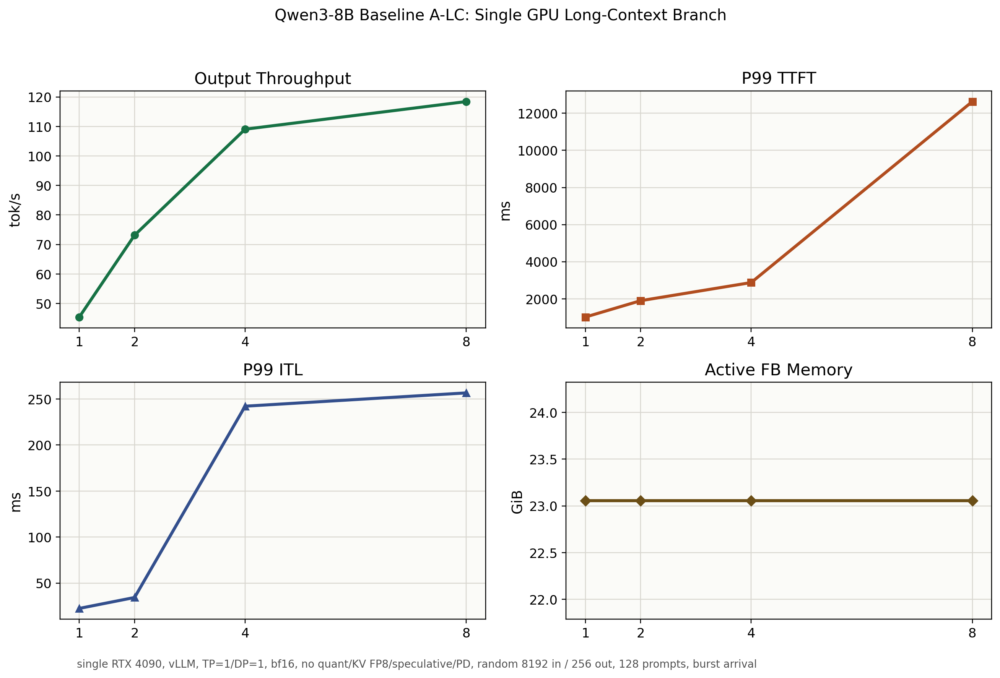

# Baseline A-LC: Single GPU Long-Context Branch

## Purpose

Baseline A-LC is the `DP=1` long-context branch. It is the reference for evaluating long-context optimizations while keeping `DP=1` fixed, especially KV cache FP8 and profiling-guided changes.

## Setup

| Item | Value |
|---|---|
| Model | `Qwen3-8B` dense |
| GPU | single `NVIDIA GeForce RTX 4090` |
| Serving stack | `vLLM` |
| Parallelism | `TP=1`, `DP=1` |
| dtype | `bfloat16` |
| Weight quantization | none |
| KV cache FP8 | disabled |
| Speculative decoding | disabled |
| Prefill/decode disaggregation | disabled |
| Prompt / output | `8192 / 256` tokens |
| Prompts | `128` |
| Arrival | burst, `request_rate=inf` |
| Max concurrency | `1 / 2 / 4 / 8` |
| Seed / temperature | `42 / 0` |

## Result Summary

| Max concurrency | Output tok/s | Req/s | P99 TTFT ms | P99 TPOT ms | P99 ITL ms | P99 E2EL ms | Active avg SM % | Active avg FB GiB | Active max FB GiB |
|---:|---:|---:|---:|---:|---:|---:|---:|---:|---:|
| 1 | 45.40 | 0.18 | 1012.78 | 18.28 | 22.49 | 5660.96 | 98.25 | 23.06 | 23.06 |
| 2 | 73.13 | 0.29 | 1895.94 | 23.57 | 34.36 | 7208.92 | 100.00 | 23.06 | 23.06 |
| 4 | 109.05 | 0.43 | 2873.78 | 32.05 | 242.18 | 10129.34 | 100.00 | 23.06 | 23.06 |
| 8 | 118.42 | 0.46 | 12631.63 | 38.23 | 256.62 | 22183.35 | 100.00 | 23.06 | 23.06 |

## Observations

- Output throughput improves from `45.40 tok/s` at concurrency `1` to `118.42 tok/s` at concurrency `8`, about `2.61x`.
- Long prefill dominates TTFT: P99 TTFT is `1012.78 ms` at concurrency `1` and rises to `12631.63 ms` at concurrency `8`.
- Decode tail latency starts to break at higher concurrency: P99 ITL is `242.18 ms` at concurrency `4` and `256.62 ms` at concurrency `8`.
- Output throughput nearly plateaus from concurrency `4` to `8`: `109.05 tok/s` to `118.42 tok/s`, while tail latency worsens sharply.
- vLLM internal metrics are available through a separate `NUM_PROMPTS=64` supplement run; see Metrics Supplement below.

## Metrics Supplement

The main A-LC performance table uses `NUM_PROMPTS=128`. The following metrics supplement uses the same workload shape with `NUM_PROMPTS=64` to capture vLLM `/metrics` without rerunning the full benchmark duration.

| Max concurrency | Max KV usage % | Est. max blocks | Est. max KV tokens | Max running | Max waiting | Waiting capacity | Prefix hit ratio |
|---:|---:|---:|---:|---:|---:|---:|---:|
| 1 | 17.69 | 528.2 | 8451 | 1 | 0 | 0 | 0.00% |
| 2 | 35.39 | 1056.4 | 16902 | 2 | 1 | 1 | 0.00% |
| 4 | 70.74 | 2111.7 | 33787 | 4 | 3 | 3 | 0.00% |
| 8 | 88.44 | 2639.9 | 42238 | 5 | 7 | 7 | 0.00% |

- Prefix cache hit ratio remains `0%`, as expected for random prompts.
- KV cache pressure rises to `88.44%` at concurrency `8`, roughly `2639.9` allocated blocks.
- Waiting pressure appears in the high-concurrency long-context case: max waiting reaches `7` at concurrency `8`.

## Interpretation

Baseline A-LC exposes the `DP=1` long-context saturation boundary. Concurrency `4` is already a strong stress point, and concurrency `8` behaves like a tail-latency cliff rather than a useful throughput scaling point.

This branch should primarily be used for same-track A/B experiments: A-LC dense vs A-LC weight quantization, A-LC dense vs A-LC KV FP8, or A-LC before/after profiling-guided runtime changes. B-LC is a separate DP=2 track and should not be treated as the main comparison target.

## Artifacts

- Raw benchmark JSON/log/dmon files: `results/tables/Qwen3-8B/baseline_a_dp1_long_context/`
- Summary JSON: `results/tables/Qwen3-8B/baseline_a_dp1_long_context/baseline_a_dp1_long_context_summary.json`
- Figure: `benchmark/projects/qwen3_8b_dense/assets/baseline_a_dp1_long_context_concurrency.png`
