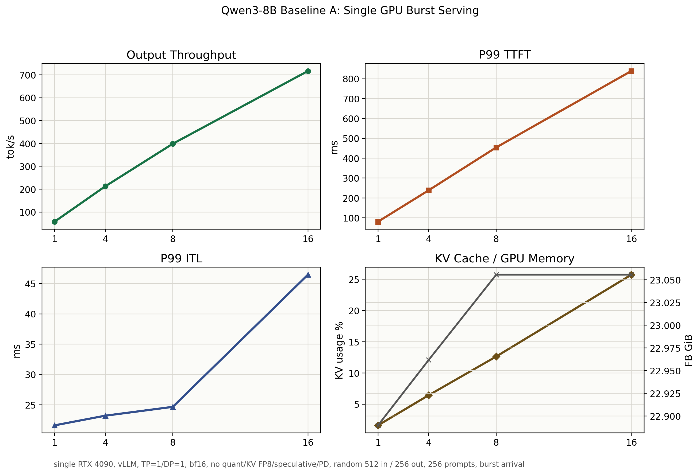

# Baseline A: Single GPU Serving Baseline

## Purpose

Baseline A is the `DP=1` burst-arrival serving reference for Qwen3-8B dense. It is the clean comparison point for optimizations evaluated under the same `DP=1` serving configuration, such as weight quantization, KV cache FP8, or profiling-guided runtime changes.

## Setup

| Item | Value |
|---|---|
| Model | `Qwen3-8B` dense |
| GPU | single `NVIDIA GeForce RTX 4090` |
| Serving stack | `vLLM` |
| Parallelism | `TP=1`, `DP=1` |
| dtype | `bfloat16` |
| Weight quantization | none |
| KV cache FP8 | disabled |
| Speculative decoding | disabled |
| Prefill/decode disaggregation | disabled |
| Prompt / output | `512 / 256` tokens |
| Prompts | `256` |
| Arrival | burst, `request_rate=inf` |
| Max concurrency | `1 / 4 / 8 / 16` |
| Seed / temperature | `42 / 0` |

## Result Summary

| Max concurrency | Output tok/s | Req/s | P99 TTFT ms | P99 TPOT ms | P99 ITL ms | P99 E2EL ms | Max KV usage % | Est. max blocks | Max waiting | Active avg FB GiB |
|---:|---:|---:|---:|---:|---:|---:|---:|---:|---:|---:|
| 1 | 57.90 | 0.23 | 80.47 | 17.07 | 21.61 | 4430.94 | 1.61 | 48.0 | 0 | 22.89 |
| 4 | 212.49 | 0.83 | 238.33 | 18.59 | 23.20 | 4854.95 | 6.43 | 192.1 | 0 | 22.96 |
| 8 | 398.60 | 1.56 | 454.29 | 19.77 | 24.66 | 5201.96 | 12.63 | 377.1 | 2 | 23.06 |
| 16 | 716.73 | 2.80 | 838.85 | 22.03 | 46.46 | 5969.18 | 25.74 | 768.3 | 2 | 23.06 |

## Observations

- Output throughput scales from `57.90 tok/s` at concurrency `1` to `716.73 tok/s` at concurrency `16`, about `12.38x`.
- P99 TTFT grows from `80.47 ms` to `838.85 ms`; burst concurrency mainly raises queueing/prefill admission latency.
- P99 ITL remains moderate through concurrency `8` and reaches `46.46 ms` at concurrency `16`.
- Max KV cache usage increases from `1.61%` to `25.74%`, corresponding to roughly `768.3` allocated KV blocks at the peak.
- Prefix cache hit ratio is `0.00%` in this random workload, as expected.

## Interpretation

Baseline A shows the `DP=1` burst-serving behavior. Throughput scales with concurrency, but c=16 starts to show higher TTFT and ITL tails. This is the right reference for evaluating optimizations while keeping `DP=1` fixed.

Baseline B is a separate `DP=2` serving track. It provides context, but the main optimization question for Baseline A is how each strategy changes the `DP=1` behavior relative to this baseline.

The metrics capture adds internal vLLM state: KV usage, estimated allocated KV blocks, prefix-cache counters, and running/waiting request pressure. This should be preserved for all later baselines and A/B tests.

## Artifacts

- Raw benchmark JSON/log/dmon/metrics files: `results/tables/Qwen3-8B/baseline_a_dp1_standard/`
- Summary JSON: `results/tables/Qwen3-8B/baseline_a_dp1_standard/baseline_a_dp1_standard_summary.json`
- Figure: `benchmark/projects/qwen3_8b_dense/assets/baseline_a_dp1_standard_concurrency.png`
