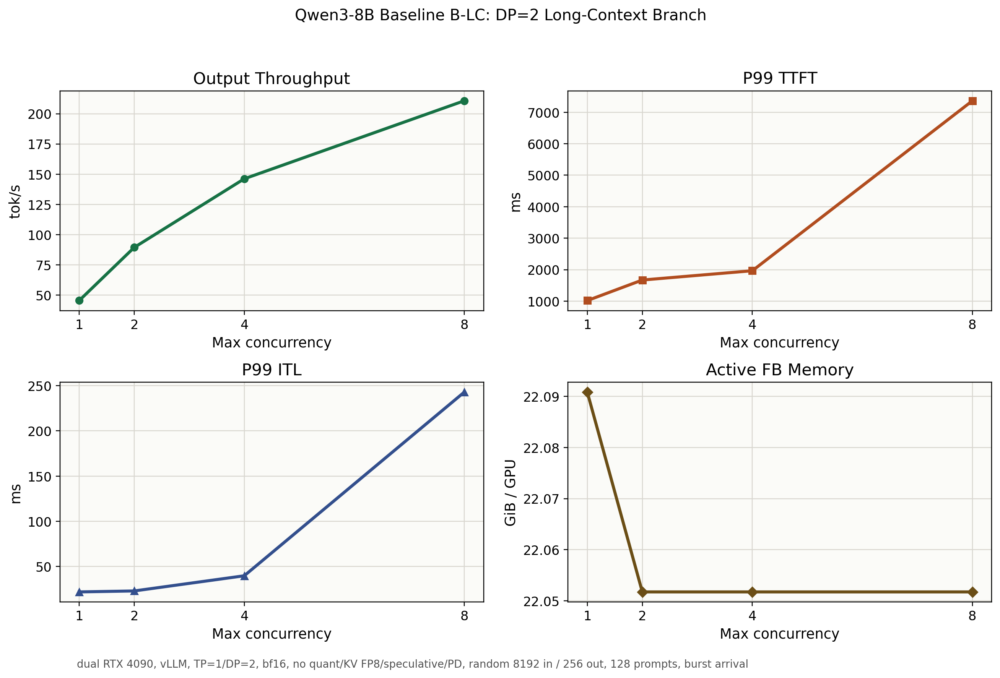

# Baseline B-LC: DP=2 Long-Context Branch

## Purpose

Baseline B-LC is the long-context branch of `Baseline B: DP=2 standard baseline`. It is the fixed DP=2 comparison point for PD separation, weight quantization, and KV cache FP8 experiments.

## Setup

| Item | Value |
|---|---|
| Model | `Qwen3-8B` dense |
| GPU | dual `NVIDIA GeForce RTX 4090` |
| Serving stack | `vLLM` |
| Parallelism | `TP=1`, `DP=2` |
| dtype | `bfloat16` |
| Weight quantization | none |
| KV cache FP8 | disabled |
| Speculative decoding | disabled |
| Prefill/decode disaggregation | disabled |
| Prompt / output | `8192 / 256` tokens |
| Prompts | `128` |
| Arrival | burst, `request_rate=inf` |
| Max concurrency | `1 / 2 / 4 / 8` |
| Seed / temperature | `42 / 0` |

## Result Summary

| Max concurrency | Output tok/s | Req/s | P99 TTFT ms | P99 TPOT ms | P99 ITL ms | P99 E2EL ms | Active avg SM % | Active avg FB GiB/GPU | Active max FB GiB |
|---:|---:|---:|---:|---:|---:|---:|---:|---:|---:|
| 1 | 45.39 | 0.18 | 1017.40 | 18.26 | 21.92 | 5662.64 | 98.21 | 22.09 | 22.09 |
| 2 | 89.35 | 0.35 | 1670.04 | 23.49 | 22.99 | 6970.56 | 99.22 | 22.05 | 22.09 |
| 4 | 146.16 | 0.57 | 1965.02 | 23.52 | 39.77 | 7371.65 | 99.98 | 22.05 | 22.09 |
| 8 | 210.74 | 0.82 | 7365.05 | 32.70 | 242.91 | 15553.38 | 99.97 | 22.05 | 22.09 |

## Observations

- Output throughput improves from `45.39 tok/s` at concurrency `1` to `210.74 tok/s` at concurrency `8`, about `4.64x`.
- Long prefill is immediately visible: P99 TTFT is already `1017.40 ms` at concurrency `1`, compared with about `102.76 ms` in short-context Baseline B.
- Tail latency degrades sharply at concurrency `8`: P99 TTFT reaches `7365.05 ms` and P99 ITL reaches `242.91 ms`.
- Active FB memory stays near a high-water mark around `22.05-22.09 GiB/GPU` across the sweep.

## Interpretation

This branch successfully exposes the long-context bottleneck that the short-context DP=2 baseline mostly hides. Throughput still scales with concurrency, but the tail behavior changes: at higher concurrency, long prefills inflate TTFT and can disturb decode-token latency.

For later A/B tests within the `DP=2` track, this branch should be the primary comparison point for KV FP8 and PD separation. KV FP8 should be judged by memory pressure and high-concurrency stability; PD separation should be judged by whether it reduces decode tail spikes and TTFT interference under bursty long-prefill arrivals.

A-LC remains useful context, but B-LC should mainly be compared against optimized B-LC variants.

The dmon FB memory readings are almost flat across concurrency, which likely reflects vLLM's reserved/cache-managed memory footprint rather than exact per-request KV growth. For KV FP8, the stronger signal may come from whether the same workload can run at higher concurrency, longer context, or lower `gpu_memory_utilization` without OOM.

## Artifacts

- Raw benchmark JSON/log/dmon files: `results/tables/Qwen3-8B/baseline_b_dp2_long_context/`
- Summary JSON: `results/tables/Qwen3-8B/baseline_b_dp2_long_context/baseline_b_dp2_long_context_summary.json`
- Figure: `benchmark/projects/qwen3_8b_dense/assets/baseline_b_dp2_long_context_concurrency.png`
