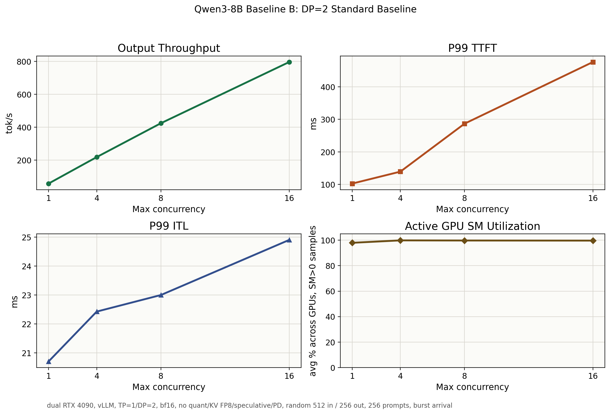

# Baseline B: DP=2 Standard Baseline

## Setup

| Item | Value |
|---|---|
| Model | `Qwen3-8B` dense |
| GPU | dual `NVIDIA GeForce RTX 4090` |
| Serving stack | `vLLM` |
| Parallelism | `TP=1`, `DP=2` |
| dtype | `bfloat16` |
| Weight quantization | none |
| KV cache FP8 | disabled |
| Speculative decoding | disabled |
| Prefill/decode disaggregation | disabled |
| Prompt / output | `512 / 256` tokens |
| Prompts | `256` |
| Arrival | burst, `request_rate=inf` |
| Max concurrency | `1 / 4 / 8 / 16` |

## Result Summary

| Max concurrency | Output tok/s | Req/s | P99 TTFT ms | P99 TPOT ms | P99 ITL ms | P99 E2EL ms | Active avg SM % | Active avg FB GiB/GPU | Active max FB GiB |
|---:|---:|---:|---:|---:|---:|---:|---:|---:|---:|
| 1 | 57.79 | 0.23 | 102.76 | 17.09 | 20.71 | 4444.66 | 97.97 | 21.89 | 21.92 |
| 4 | 218.56 | 0.85 | 139.43 | 18.25 | 22.43 | 4832.11 | 99.87 | 21.89 | 21.92 |
| 8 | 424.21 | 1.66 | 286.69 | 18.59 | 23.00 | 4890.80 | 99.77 | 21.96 | 22.00 |
| 16 | 795.97 | 3.11 | 476.06 | 19.76 | 24.90 | 5264.04 | 99.69 | 22.05 | 22.09 |

## Observations

- Throughput scales from `57.79 tok/s` at concurrency `1` to `795.97 tok/s` at concurrency `16`, about `13.77x`.
- P99 TTFT rises from `102.76 ms` to `476.06 ms` as burst concurrency increases.
- P99 ITL stays relatively controlled: `20.71 ms` at concurrency `1` and `24.90 ms` at concurrency `16`.
- Active GPU SM utilization reaches `99.69%` across GPUs at concurrency `16`, indicating the DP=2 setup is close to fully occupying both cards during active serving windows.
- GPU memory is already high at low concurrency: active FB memory is about `21.89 GiB/GPU` at concurrency `1`.
- Memory rises only slightly with this `512 / 256` workload, reaching about `22.05 GiB/GPU` average and `22.09 GiB` max on any GPU at concurrency `16`.

## Interpretation

Baseline B is the `DP=2` data-parallel serving reference. It describes the dense, unoptimized behavior for the DP=2 track before applying weight quantization, KV cache changes, PD separation, or profiling-guided runtime changes.

The memory picture suggests this baseline is dominated by persistent model/runtime/KV-reservation footprint rather than per-request KV growth. For this short-context workload, increasing concurrency from `1` to `16` adds only about `0.16 GiB/GPU` active FB memory on average.

This baseline is the right comparison point for later A/B tests that keep `DP=2` fixed, such as weight quantization or KV cache FP8. It should not be mixed with `TP=2` results, because TP introduces PCIe/NCCL communication into the critical path.

Baseline A is useful context, but the main claim for this track should be made by comparing Baseline B against optimized DP=2 variants.

## Artifacts

- Raw benchmark JSON/log/dmon files: `results/tables/Qwen3-8B/baseline_b_dp2_standard/`
- Summary JSON: `results/tables/Qwen3-8B/baseline_b_dp2_standard/baseline_b_dp2_standard_summary.json`
- Figure: `benchmark/projects/qwen3_8b_dense/assets/baseline_b_dp2_standard_concurrency.png`
