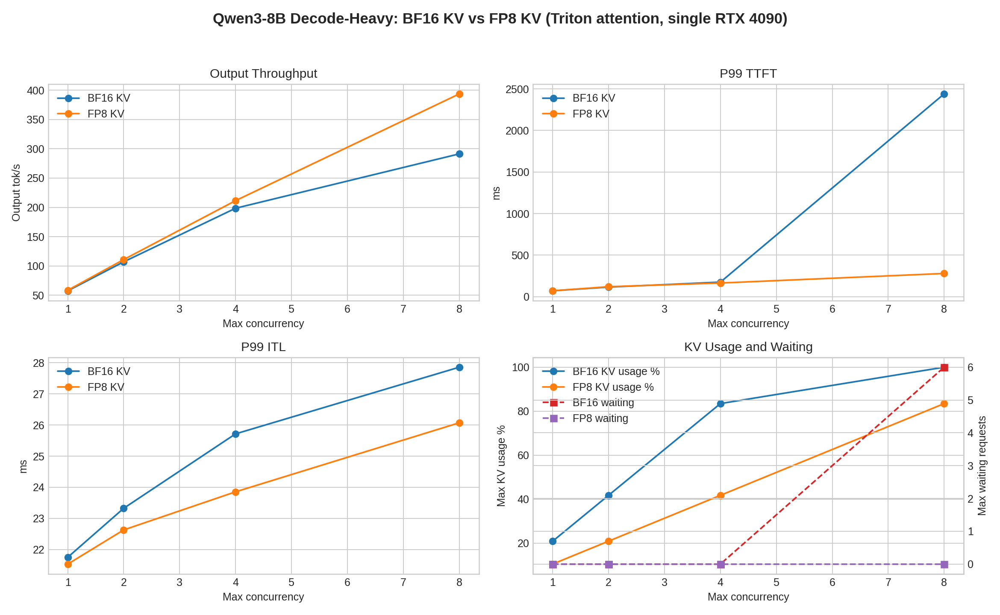

# FP8 KV Decode-Heavy A/B

## Purpose

This experiment tests whether FP8 KV cache improves the decode-heavy serving case under the same fixed Triton attention backend.

The workload is intentionally decode-heavy:

```text
Prompt: 256 tokens
Output: 8192 tokens
```

This stresses long-lived KV residency rather than long prefill compute.

## Setup

| Item | BF16 KV control | FP8 KV treatment |
|---|---|---|
| Model | `Qwen3-8B` | `Qwen3-8B` |
| GPU | single `NVIDIA GeForce RTX 4090` | single `NVIDIA GeForce RTX 4090` |
| Serving stack | `vLLM` | `vLLM` |
| Attention backend | `TRITON_ATTN` | `TRITON_ATTN` |
| Weight dtype | `bfloat16` | `bfloat16` |
| KV cache dtype | default | `fp8` |
| TP / DP | `1 / 1` | `1 / 1` |
| Prompt / output | `256 / 8192` | `256 / 8192` |
| Arrival | burst, `request_rate=inf` | burst, `request_rate=inf` |
| Seed / temperature | `42 / 0` | `42 / 0` |

FP8 KV was launched without `--calculate-kv-scales`. In this vLLM build that option is deprecated; scales are loaded from the checkpoint when available, otherwise they default to `1.0`.

## Result

| Max concurrency | BF16 out tok/s | FP8 out tok/s | Throughput delta | BF16 P99 TTFT | FP8 P99 TTFT | BF16 P99 ITL | FP8 P99 ITL | BF16 KV usage | FP8 KV usage | BF16 waiting | FP8 waiting |
|---:|---:|---:|---:|---:|---:|---:|---:|---:|---:|---:|---:|
| 1 | 57.58 | 58.54 | +1.7% | 70.97 ms | 71.48 ms | 21.75 ms | 21.53 ms | 20.82% | 10.43% | 0 | 0 |
| 2 | 107.03 | 110.92 | +3.6% | 115.34 ms | 120.23 ms | 23.33 ms | 22.63 ms | 41.72% | 20.86% | 0 | 0 |
| 4 | 198.52 | 211.48 | +6.5% | 175.43 ms | 164.57 ms | 25.72 ms | 23.85 ms | 83.45% | 41.71% | 0 | 0 |
| 8 | 291.32 | 393.70 | +35.1% | 2439.75 ms | 279.48 ms | 27.86 ms | 26.07 ms | 100.00% | 83.43% | 6 | 0 |



## Interpretation

FP8 KV gives exactly the improvement this workload was designed to expose.

The number of GPU KV blocks doubles:

```text
BF16/default KV: 2532 blocks
FP8 KV:          5064 blocks
```

At low concurrency, the effect is mostly capacity headroom:

- KV usage is almost halved.
- TTFT and ITL remain close to the BF16 control.
- Throughput improves modestly.

At `c=8`, FP8 KV changes the serving regime:

- BF16 KV reaches `100%` KV usage and has `6` waiting requests.
- FP8 KV stays at `83.43%` KV usage and has `0` waiting requests.
- P99 TTFT drops from `2439.75 ms` to `279.48 ms`.
- Output throughput increases from `291.32 tok/s` to `393.70 tok/s`.

This means the BF16 run was not primarily decode-kernel limited at `c=8`; it was admission/KV-capacity limited. FP8 KV removes that pressure point and lets the scheduler keep all eight long-decode requests resident.

## Takeaway

For short-prompt long-output serving on a single RTX 4090, FP8 KV is a strong optimization because long decode requests hold KV blocks for a long time.

The most important gain is not merely lower KV memory usage. It is avoiding the transition into a waiting/admission-limited regime at high concurrency.

## Artifacts

- FP8 raw benchmark files: `results/tables/Qwen3-8B/kv_fp8_dp1_short_prompt_long_output_triton_attn/`
- BF16 source summary: `benchmark/projects/qwen3_8b_dense/data/triton_attn_prefill_vs_decode_heavy.json`
- Comparison JSON: `benchmark/projects/qwen3_8b_dense/data/kv_fp8_decode_heavy_vs_bf16_triton.json`
- Figure: `benchmark/projects/qwen3_8b_dense/assets/kv_fp8_decode_heavy_vs_bf16_triton.png`
