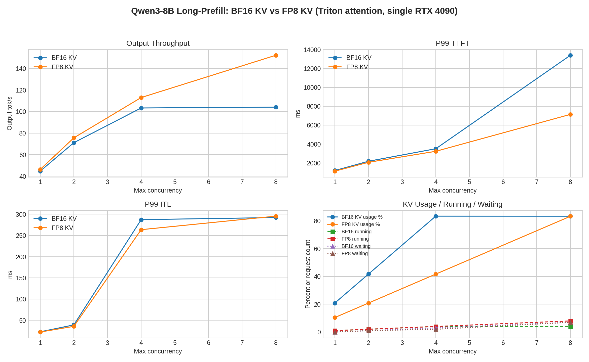

# FP8 KV Long-Prefill A/B

## Purpose

This experiment tests FP8 KV cache on the long-prefill branch under the same fixed Triton attention backend.

The workload is prefill-heavy:

```text
Prompt: 8192 tokens
Output: 256 tokens
```

This stresses prompt prefill, KV allocation, and scheduler admission under long contexts.

## Setup

| Item | BF16 KV control | FP8 KV treatment |
|---|---|---|
| Model | `Qwen3-8B` | `Qwen3-8B` |
| GPU | single `NVIDIA GeForce RTX 4090` | single `NVIDIA GeForce RTX 4090` |
| Serving stack | `vLLM` | `vLLM` |
| Attention backend | `TRITON_ATTN` | `TRITON_ATTN` |
| Weight dtype | `bfloat16` | `bfloat16` |
| KV cache dtype | default | `fp8` |
| TP / DP | `1 / 1` | `1 / 1` |
| Prompt / output | `8192 / 256` | `8192 / 256` |
| Prompts | `128` | `128` |
| Arrival | burst, `request_rate=inf` | burst, `request_rate=inf` |
| Seed / temperature | `42 / 0` | `42 / 0` |

FP8 KV was launched without `--calculate-kv-scales`. In this vLLM build that option is deprecated; scales are loaded from the checkpoint when available, otherwise they default to `1.0`.

## Result

| Max concurrency | BF16 out tok/s | FP8 out tok/s | Throughput delta | BF16 P99 TTFT | FP8 P99 TTFT | BF16 P99 ITL | FP8 P99 ITL | BF16 KV usage | FP8 KV usage | BF16 running/waiting | FP8 running/waiting |
|---:|---:|---:|---:|---:|---:|---:|---:|---:|---:|---:|---:|
| 1 | 44.74 | 46.31 | +3.5% | 1198.98 ms | 1133.01 ms | 22.81 ms | 22.27 ms | 20.86% | 10.43% | 1 / 0 | 1 / 0 |
| 2 | 71.14 | 75.64 | +6.3% | 2182.62 ms | 2070.41 ms | 39.10 ms | 35.68 ms | 41.72% | 20.86% | 2 / 1 | 2 / 1 |
| 4 | 103.33 | 112.99 | +9.3% | 3506.05 ms | 3234.24 ms | 287.38 ms | 263.72 ms | 83.45% | 41.71% | 4 / 3 | 4 / 2 |
| 8 | 104.09 | 152.20 | +46.2% | 13395.54 ms | 7142.52 ms | 292.31 ms | 295.65 ms | 83.41% | 83.35% | 4 / 7 | 8 / 7 |



## Interpretation

FP8 KV doubles the available GPU KV blocks:

```text
BF16/default KV: 2532 blocks
FP8 KV:          5064 blocks
```

For `c=1` to `c=4`, the direct effect is simple:

- KV usage is nearly halved.
- Throughput improves by `3.5%` to `9.3%`.
- P99 TTFT improves modestly by `5.1%` to `7.8%`.

At `c=8`, FP8 KV changes the scheduler regime:

- BF16 KV can keep only `4` requests running.
- FP8 KV can keep all `8` requests running.
- Output throughput increases by `46.2%`.
- P99 TTFT drops from `13.40 s` to `7.14 s`.

However, P99 ITL does not improve at `c=8`:

```text
BF16 KV P99 ITL: 292.31 ms
FP8 KV P99 ITL:  295.65 ms
```

This means FP8 KV is not making the long-prefill kernels themselves much faster. It is primarily improving capacity and admission: more long-context requests can stay resident, so the system drains the burst faster and tail TTFT drops.

## Takeaway

For long-prefill serving, FP8 KV helps most when BF16 KV capacity restricts how many long-context requests can run simultaneously.

The main win is scheduler/admission headroom, not per-token decode latency. This is different from the decode-heavy branch, where FP8 KV removed a hard `100%` KV usage point and eliminated waiting at `c=8`.

## Artifacts

- BF16 raw benchmark files: `results/tables/Qwen3-8B/baseline_a_dp1_long_context_triton_attn/`
- FP8 raw benchmark files: `results/tables/Qwen3-8B/kv_fp8_dp1_long_context_triton_attn/`
- Comparison JSON: `benchmark/projects/qwen3_8b_dense/data/kv_fp8_long_prefill_vs_bf16_triton.json`
- Figure: `benchmark/projects/qwen3_8b_dense/assets/kv_fp8_long_prefill_vs_bf16_triton.png`
