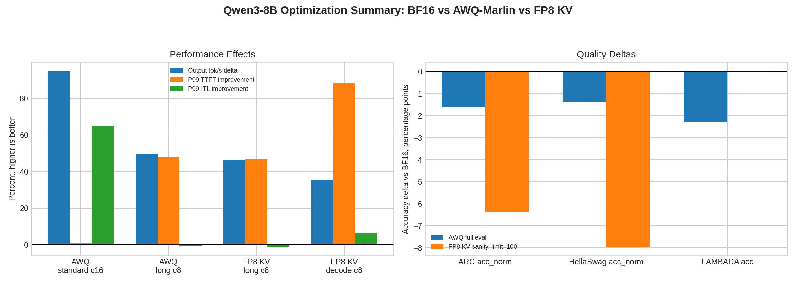

# Optimization Summary: BF16 vs AWQ-Marlin vs FP8 KV

## Purpose

This page summarizes the single-GPU Qwen3-8B optimization story so far: BF16 baseline, AWQ-Marlin weight quantization, and FP8 KV cache.

The goal is not to declare one universal winner. The goal is to show which bottleneck each optimization addresses.

## Scope

| Item | Value |
|---|---|
| Model | `Qwen3-8B` |
| GPU | single `NVIDIA GeForce RTX 4090` |
| Serving stack | `vLLM` |
| Parallelism | `TP=1`, `DP=1` |
| Baseline | BF16 weights, default KV cache |
| Weight quantization | AWQ-Marlin |
| KV optimization | FP8 KV cache |

Important caveat: AWQ and BF16 quality runs use full lm-eval task sizes. FP8 KV quality is currently a `limit=100` sanity check, so it is useful as a smoke test but not yet a full quality claim.

## Performance Summary

| Optimization | Scenario | Workload | Output tok/s delta | P99 TTFT delta | P99 ITL delta | Main mechanism |
|---|---|---|---:|---:|---:|---|
| AWQ-Marlin weights | standard serving | `512 input / 256 output, c=16` | +95.1% | -0.9% | -65.2% | reduces weight bandwidth in decode-heavy generation |
| AWQ-Marlin weights | long-context serving | `8192 input / 256 output, c=8` | +49.7% | -48.0% | +0.7% | reduces weight bandwidth, but long-prefill interference remains |
| FP8 KV cache | long-prefill Triton branch | `8192 input / 256 output, c=8` | +46.2% | -46.7% | +1.1% | doubles KV blocks; improves admission/running residency |
| FP8 KV cache | decode-heavy Triton branch | `256 input / 8192 output, c=8` | +35.1% | -88.5% | -6.4% | removes KV-capacity admission bottleneck for long decode residency |

## Capacity Signals

| Optimization | Scenario | Capacity / scheduler signal |
|---|---|---|
| AWQ-Marlin weights | standard serving | n/a |
| AWQ-Marlin weights | long-context serving | KV usage lower from smaller weights/headroom; ITL not improved at c=8 |
| FP8 KV cache | long-prefill Triton branch | GPU KV blocks 2532 -> 5064; running 4 -> 8; waiting still 7 |
| FP8 KV cache | decode-heavy Triton branch | GPU KV blocks 2532 -> 5064; KV usage 100.0% -> 83.4%; waiting 6 -> 0 |

## Quality Summary

| Variant | Eval scope | ARC acc_norm | HellaSwag acc_norm | LAMBADA acc | LAMBADA ppl |
|---|---|---:|---:|---:|---:|
| BF16 baseline | full | 0.5640 +/- 0.0145 | 0.7496 +/- 0.0043 | 0.6497 +/- 0.0066 | 4.5944 +/- 0.1387 |
| AWQ-Marlin | full | 0.5478 +/- 0.0145 (-1.62 pp) | 0.7359 +/- 0.0044 (-1.36 pp) | 0.6266 +/- 0.0067 (-2.31 pp) | 5.1956 +/- 0.1659 (+13.1%) |
| FP8 KV | sanity `limit=100` | 0.5000 +/- 0.0503 (-6.40 pp) | 0.6700 +/- 0.0473 (-7.96 pp) | 0.6500 +/- 0.0479 (+0.03 pp) | 4.4753 +/- 0.8991 (-2.6%) |

## Interpretation

- AWQ-Marlin is the strongest decode/weight-bandwidth optimization. It greatly improves output throughput and ITL in the standard serving branch, but the full quality run shows small measurable drops on HellaSwag and LAMBADA.
- FP8 KV is the strongest KV-residency optimization. It does not reduce the logical number of KV tokens, but it doubles available KV blocks and prevents admission bottlenecks in high-concurrency long-context or long-decode cases.
- FP8 KV decode-heavy is the cleanest win: at `c=8`, waiting goes from `6` to `0`, P99 TTFT drops by `88.5%`, and output throughput improves by `35.1%`.
- FP8 KV long-prefill also helps, but mostly through scheduler/admission headroom. It raises running requests from `4` to `8` at `c=8`, yet P99 ITL remains roughly unchanged because long prefill compute still interferes with decode cadence.
- The FP8 KV quality sanity check does not show an obvious catastrophic regression, but because it used only 100 examples per task, the full quality run is still needed before making a strong quality claim.

## Where This Points Next

1. Run full FP8 KV quality if this result will be presented as quality-neutral.
2. Test AWQ + FP8 KV together on `256/8192` decode-heavy; their mechanisms are complementary.
3. Use PD separation to target the remaining long-prefill problem: prefill/decode interference and high P99 ITL, not raw KV capacity.
4. Keep QKV/FFN fusion behind profiling evidence; current wins are already explained by bandwidth, KV residency, and scheduler effects.

## Artifacts

- Summary JSON: `benchmark/projects/qwen3_8b_dense/data/optimization_summary_bf16_awq_fp8.json`
- Summary figure: `benchmark/projects/qwen3_8b_dense/assets/optimization_summary_bf16_awq_fp8.png`
- AWQ quality: `benchmark/projects/qwen3_8b_dense/awq_marlin_dp1_quality.md`
- FP8 KV long-prefill: `benchmark/projects/qwen3_8b_dense/kv_fp8_long_prefill.md`
- FP8 KV decode-heavy: `benchmark/projects/qwen3_8b_dense/kv_fp8_decode_heavy.md`
