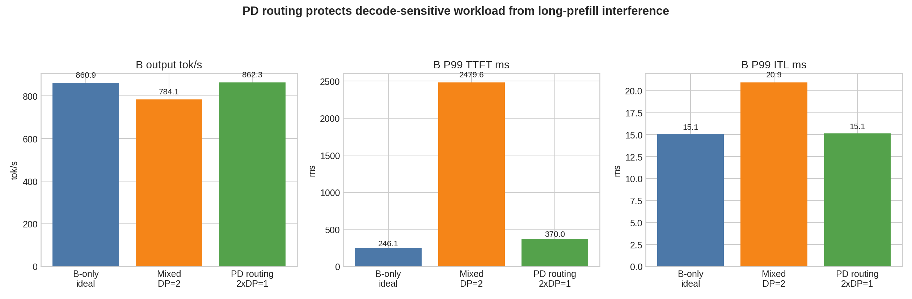

# PD Routing Results

## Purpose

This experiment checks whether workload-level routing can protect decode-sensitive requests from long-prefill interference.

This is not KV-transfer-based disaggregated prefill/decode. It is request-level routing into isolated serving pools.

## Workloads

| Workload | Shape | Concurrency | Prompts | Role |
|---|---:|---:|---:|---|
| A | `8192 input / 256 output` | 4 | 128 | long-prefill interference source |
| B | `256 input / 8192 output` | 8 | 32 | decode-sensitive target |

## Deployment Lines

| Line | Deployment | A route | B route |
|---|---|---|---|
| B-only ideal | one DP=1 endpoint | not running | GPU0/GPU1 single endpoint from prior decode-heavy run |
| Mixed baseline | one DP=2 endpoint | same port `8000` | same port `8000` |
| PD routing | two DP=1 endpoints | GPU0 / port `8000` | GPU1 / port `8001` |

## B-Side Results

| Line | B output tok/s | B P99 TTFT | B P99 ITL | B P99 E2EL | Completed / failed |
|---|---:|---:|---:|---:|---:|
| B-only ideal | 860.91 | 246.13 ms | 15.09 ms | 76.19 s | 32 / 0 |
| Mixed baseline | 784.11 | 2479.64 ms | 20.93 ms | 112.26 s | 32 / 0 |
| PD routing | 862.27 | 370.05 ms | 15.15 ms | 76.10 s | 32 / 0 |

## A-Side Context

| Line | A output tok/s | A P99 TTFT | A P99 ITL | Completed / failed |
|---|---:|---:|---:|---:|
| Mixed baseline | 227.94 | 2097.39 ms | 209.45 ms | 128 / 0 |
| PD routing | 163.48 | 3998.51 ms | 257.07 ms | 128 / 0 |

## Interpretation

- Mixed baseline increases B-side P99 ITL from the ideal `15.09 ms` to `20.93 ms`.
- PD routing brings B-side P99 ITL back to `15.15 ms`, effectively matching the B-only ideal.
- B-side P99 TTFT improves from `2479.64 ms` in mixed baseline to `370.05 ms` under routing, a `-85.1%` change.
- B output throughput improves from `784.11` to `862.27 tok/s`, a `+10.0%` change.
- This supports the claim that long-prefill traffic can interfere with decode-sensitive latency when mixed behind a shared serving endpoint, and that routing can protect the decode-sensitive pool.

## Caveat

This is workload-level PD routing. It does not transfer KV from a prefill worker to a decode worker for the same request. A true KV-transfer PD implementation would be a deeper systems experiment.

## Artifacts

- Mixed baseline raw results: `results/tables/Qwen3-8B/pd_routing/mixed_baseline_dp2_a4_b8/`
- PD routing raw results: `results/tables/Qwen3-8B/pd_routing/routed_dp1_a4_b8/`
- Summary JSON: `benchmark/projects/qwen3_8b_dense/data/pd_routing_mixed_vs_routed.json`
- Figure: `benchmark/projects/qwen3_8b_dense/assets/pd_routing_mixed_vs_routed.png`
