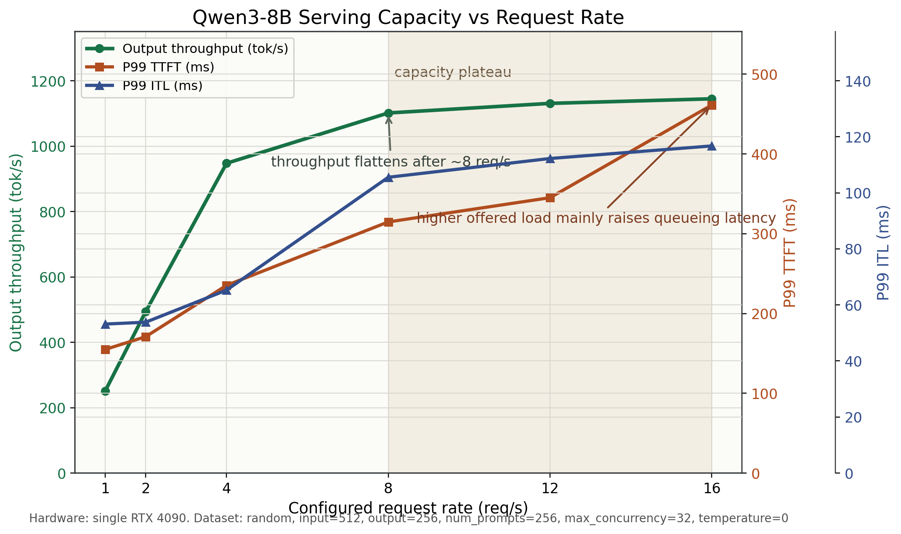

# Qwen3-8B Request Rate Capacity Sweep

This result belongs to `Baseline A: Single GPU Serving Baseline`.

## Scope

- Model: `Qwen3-8B`
- Hardware: single `NVIDIA GeForce RTX 4090`
- Backend: `vLLM`
- Tensor parallelism: `TP=1`
- dtype path: `bf16` / `fp16`
- Weight quantization: none
- KV cache FP8: disabled
- Speculative decoding: disabled
- Prefill/decode disaggregation: disabled
- Dataset: random
- Input length: `512`
- Output length: `256`
- Number of prompts: `256`
- Maximum concurrency: `32`
- Request rates: `1 / 2 / 4 / 8 / 12 / 16 req/s`

Source data:
- `benchmark/projects/qwen3_8b_dense/data/request_rate_sweep_512in_256out_single_4090.json`

Figure:
- `benchmark/projects/qwen3_8b_dense/assets/request_rate_capacity_single_4090.png`

## Result

The service scales cleanly from `1` to `4 req/s`:

- Output throughput rises from `251.43 tok/s` to `947.52 tok/s`.
- P99 TTFT grows from `154.98 ms` to `235.29 ms`.
- P99 ITL grows moderately from `53.17 ms` to `65.28 ms`.

Around `8 req/s`, the service enters a throughput plateau:

- Output throughput reaches `1101.39 tok/s`.
- Increasing request rate from `8` to `16 req/s` only raises output throughput from `1101.39` to `1144.70 tok/s`.
- That is only about `3.9%` more output throughput despite doubling offered load.

Latency continues to rise after the plateau:

- P99 TTFT increases from `314.76 ms` at `8 req/s` to `461.26 ms` at `16 req/s`.
- P99 ITL increases from `105.55 ms` at `8 req/s` to `116.73 ms` at `16 req/s`.

## Conclusion

For this single-card RTX 4090 Qwen3-8B serving setup, practical service capacity is around `8 req/s`.

Beyond that point, additional request rate mostly increases queueing and tail latency rather than improving throughput. The clean operating region is therefore below the plateau; `8 req/s` is a useful saturation boundary for this workload.
