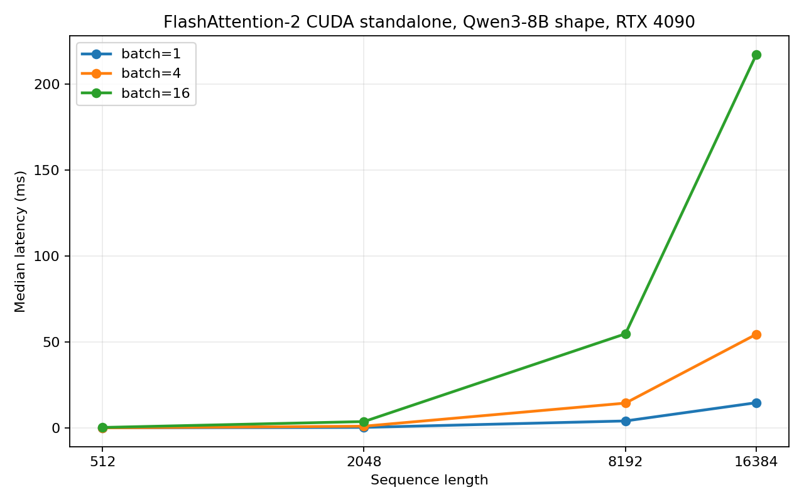
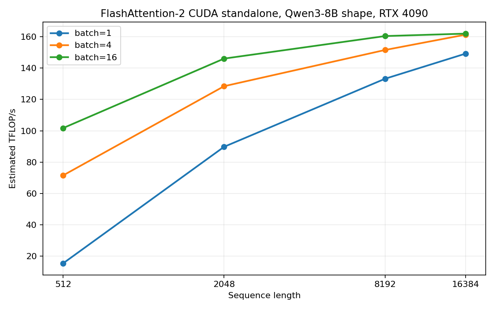

# FA2 CUDA Baseline Results

This is the first standalone FlashAttention-2 CUDA baseline for the Qwen3-8B
attention shape.

The experiment bypasses vLLM and directly calls `flash_attn.flash_attn_func`.

## Setup

| Field | Value |
|---|---|
| GPU | RTX 4090 |
| environment | `conda deeplearning` |
| flash-attn source | `/home/xuliren/repo/flash-attention` |
| dtype | BF16 |
| query heads | `32` |
| KV heads | `8` |
| head dim | `128` |
| attention | causal |
| dropout | `0` |

Expected source traits for SM89 causal head-dim 128:

```text
Flash_fwd_kernel_traits<128, 64, 64, 4, false, false, bf16>
```

## Latency Sweep

Artifacts:

- `results/tables/Qwen3-8B/fa2_cuda_standalone/fa2_latency_sweep.json`
- `results/tables/Qwen3-8B/fa2_cuda_standalone/fa2_latency_sweep.csv`

Figures:





| Batch | Seq Len | Median Latency (ms) | P90 Latency (ms) | Est. TFLOP/s | Max Allocated GB |
|---:|---:|---:|---:|---:|---:|
| 1 | 512 | 0.139 | 0.147 | 15.44 | 0.02 |
| 1 | 2048 | 0.383 | 0.411 | 89.78 | 0.08 |
| 1 | 8192 | 4.128 | 4.171 | 133.20 | 0.30 |
| 1 | 16384 | 14.738 | 14.807 | 149.22 | 0.60 |
| 4 | 512 | 0.120 | 0.129 | 71.53 | 0.08 |
| 4 | 2048 | 1.071 | 1.111 | 128.44 | 0.30 |
| 4 | 8192 | 14.512 | 14.558 | 151.55 | 1.21 |
| 4 | 16384 | 54.528 | 55.150 | 161.32 | 2.42 |
| 16 | 512 | 0.338 | 0.378 | 101.72 | 0.30 |
| 16 | 2048 | 3.766 | 3.815 | 146.04 | 1.21 |
| 16 | 8192 | 54.837 | 55.725 | 160.42 | 4.83 |
| 16 | 16384 | 217.235 | 218.661 | 161.97 | 9.66 |

## NCU Single-Point Profile

Profile point:

```text
batch = 1
seq_len = 8192
dtype = BF16
causal = true
```

Artifacts:

- `results/traces/ncu/fa2_cuda_standalone/b1_s8192/b1_s8192_run1/fa2_cuda__b1__s8192__bf16__b1_s8192_run1.ncu-rep`
- `results/analysis/profiling/ncu/fa2_cuda_standalone_b1_s8192/ncu_details.csv`
- `results/analysis/profiling/ncu/fa2_cuda_standalone_b1_s8192/ncu_summary.json`

The demangled kernel name directly confirms the expected traits:

```text
flash_fwd_kernel<
  Flash_fwd_kernel_traits<128, 64, 64, 4, false, false, bf16>
>
```

Key NCU metrics:

| Metric | Value |
|---|---:|
| kernel duration | 4.248 ms |
| grid size | 4096 |
| block size | 128 |
| registers / thread | 182 |
| dynamic shared memory / block | 49.15 KB |
| waves / SM | 16 |
| theoretical occupancy | 16.67% |
| achieved occupancy | 16.35% |
| SM throughput | 44.53% |
| DRAM throughput | 3.42% |
| L2 throughput | 45.72% |
| L2 hit rate | 98.85% |
| issue active | 11.59% |
| active warps / scheduler | 1.96 |
| eligible warps / scheduler | 0.15 |
| warp latency / issued inst | 16.94 cycles |

## NCU Matrix

This matrix uses one NCU profile run per point. It is not a repeated median.
Use it to compare kernel resource usage and stall trends across shapes.

Artifacts:

- `results/analysis/profiling/ncu/fa2_cuda_standalone_summary/fa2_ncu_matrix_summary.csv`
- `results/analysis/profiling/ncu/fa2_cuda_standalone_summary/fa2_ncu_matrix_summary.json`

| Batch | Seq Len | Duration (ms) | SM % | DRAM % | Regs / Thread | Smem / Block (KB) | Achieved Occ % | Eligible Warps / Scheduler | Top Stall |
|---:|---:|---:|---:|---:|---:|---:|---:|---:|---|
| 1 | 512 | 0.041 | 20.19 | 15.60 | 182 | 48.0 | 14.01 | 0.12 | CPIStall / execution pipe wait (46.9%) |
| 1 | 2048 | 0.329 | 37.00 | 7.80 | 182 | 48.0 | 15.62 | 0.14 | CPIStall / execution pipe wait (67.5%) |
| 1 | 8192 | 4.248 | 44.53 | 3.42 | 182 | 48.0 | 16.35 | 0.15 | CPIStall / execution pipe wait (70.8%) |
| 1 | 16384 | 16.366 | 46.13 | 1.94 | 182 | 48.0 | 16.49 | 0.15 | CPIStall / execution pipe wait (71.1%) |
| 16 | 512 | 0.312 | 42.54 | 46.18 | 182 | 48.0 | 16.30 | 0.16 | CPIStall / execution pipe wait (63.5%) |
| 16 | 8192 | 64.014 | 47.36 | 6.78 | 182 | 48.0 | 16.64 | 0.15 | CPIStall / execution pipe wait (71.0%) |
| 16 | 16384 | 254.131 | 47.49 | 3.45 | 182 | 48.0 | 16.65 | 0.15 | CPIStall / execution pipe wait (71.2%) |

Reading:

- The same FA2 CUDA kernel traits are used across these shapes:
  `Flash_fwd_kernel_traits<128,64,64,4,...bf16>`.
- Sequence length and batch change the amount of work, grid size, and waves, not
  the compile-time tile.
- Registers and shared memory stay fixed: `182` registers/thread and `48 KB`
  dynamic shared memory/block.
- Achieved occupancy stays low, around `14-16.7%`, because occupancy is limited
  by register and shared-memory pressure.
- Eligible warps per scheduler stay very low, around `0.12-0.16`.
- The dominant NCU rule is consistently `CPIStall / execution pipe wait`.
- DRAM utilization drops as sequence length grows, so this is not a DRAM-bound
  long-context kernel. The key limiter is scheduler/pipe availability under
  high register/shared-memory pressure.

## Large-Batch Check

To test whether larger batch size can further raise FA2 CUDA SM utilization, we
also swept `batch=32/64` at `seq=8192` and profiled `batch=32/64` with NCU.

Artifacts:

- `results/tables/Qwen3-8B/fa2_cuda_standalone/fa2_latency_sweep_large_batch.json`
- `results/analysis/profiling/ncu/fa2_cuda_standalone_summary/fa2_large_batch_8192_compare.csv`
- `results/analysis/profiling/ncu/fa2_cuda_standalone_summary/fa2_large_batch_8192_compare.json`

| Batch | Latency Median (ms) | Est. TFLOP/s | NCU Duration (ms) | SM % | DRAM % | Occ % | Eligible Warps / Scheduler | Issue Active % | Waves / SM | Top Stall % |
|---:|---:|---:|---:|---:|---:|---:|---:|---:|---:|---:|
| 16 | 54.837 | 160.42 | 64.014 | 47.36 | 6.78 | 16.64 | 0.15 | 11.64 | 256 | 71.0 |
| 32 | 109.355 | 160.89 | 127.692 | 47.43 | 6.86 | 16.65 | 0.15 | 11.65 | 512 | 71.0 |
| 64 | 219.195 | 160.54 | 255.314 | 47.49 | 6.87 | 16.65 | 0.15 | 11.65 | 1024 | 71.0 |

Reading:

- Increasing batch from `16` to `64` increases total work and waves/SM, but SM
  utilization is already at a plateau around `47.4%`.
- Estimated TFLOP/s also plateaus around `160-161`.
- Occupancy, eligible warps, and issue-active barely move.
- This means larger batch helps fill the GPU up to a point, but does not fix the
  CTA-internal limiter: high register/shared-memory pressure and low eligible
  warp availability.

## FA1 vs FA2 Same-Head Baseline

FA1 v1.0.9 does not support Qwen3's native GQA shape (`Q heads=32`, `KV
heads=8`), so this comparison uses a same-head setup:

```text
Q heads = K heads = V heads = 32
head_dim = 128
dtype = BF16
attention = causal
```

Interface alignment:

- FA1: `flash_attn_unpadded_func`
- FA2: `flash_attn_varlen_func`

Artifacts:

- `results/tables/Qwen3-8B/fa1_fa2_same_heads/fa1_latency_sweep.json`
- `results/tables/Qwen3-8B/fa1_fa2_same_heads/fa2_varlen_latency_sweep.json`
- `results/analysis/profiling/ncu/fa1_fa2_same_heads/same_heads_fa1_fa2_compare.csv`
- `results/analysis/profiling/ncu/fa1_fa2_same_heads/same_heads_fa1_fa2_compare.json`

| Backend | Batch | Latency Median (ms) | Est. TFLOP/s | NCU Duration (ms) | SM % | DRAM % | Regs | Smem KB | Occ % | Eligible Warps / Scheduler | Issue % | Waves / SM | Top Stall | Speedup |
|---|---:|---:|---:|---:|---:|---:|---:|---:|---:|---:|---:|---:|---|---:|
| FA1 | 1 | 11.262 | 48.82 | 11.413 | 16.71 | 86.30 | 255 | 40.6 | 16.58 | 0.12 | 11.20 | 1 | L1TEX scoreboard dependency (38.4%) | 1.00x |
| FA2 | 1 | 4.061 | 135.39 | 4.267 | 44.34 | 6.06 | 182 | 48.0 | 16.40 | 0.14 | 11.58 | 16 | CPIStall / execution pipe wait (66.0%) | 2.77x |
| FA1 | 16 | 193.835 | 45.38 | 197.516 | 15.45 | 89.49 | 255 | 40.6 | 16.63 | 0.11 | 10.18 | 2 | L1TEX scoreboard dependency (40.9%) | 1.00x |
| FA2 | 16 | 55.379 | 158.85 | 64.279 | 47.16 | 6.80 | 182 | 48.0 | 16.64 | 0.15 | 11.64 | 256 | CPIStall / execution pipe wait (66.3%) | 3.50x |

Initial interpretation:

- FA2 is much faster even in the same-head setting: `2.77x` at batch 1 and
  `3.50x` at batch 16 by latency median.
- FA1 has much higher DRAM utilization (`86-89%`) and much lower SM throughput
  (`15-17%`). Its top NCU stall is L1TEX scoreboard dependency, which is a
  direct memory-dependency signal.
- FA2 shifts the profile away from DRAM pressure: DRAM falls to about `6-7%`,
  while SM throughput rises to `44-47%`.
- FA1 uses more registers (`255` vs `182`) despite lower SM utilization.
- FA2 generates far more waves at batch 16 (`256` vs `2`), which shows much
  better work partitioning / parallelization across the sequence dimension.

## Initial Reading

The first FA2 CUDA profile confirms that the profile itself can expose the
compile-time traits through the demangled kernel symbol. That is better than we
expected and gives us a clean way to validate dispatch.

The performance shape is also clear:

- Small sequence length is launch/under-occupancy limited.
- Throughput improves sharply from 512 to 2048 tokens.
- Long-context points settle around `150-162` estimated TFLOP/s.
- The kernel is not DRAM-bandwidth limited at `batch=1, seq=8192`; DRAM
  throughput is only `3.42%`.
- Occupancy is intentionally low because the kernel uses high registers and
  shared memory per block.
- The key bottleneck to compare against FA1 is likely scheduler eligibility /
  pipe stalls, not raw DRAM bandwidth.

## Next Step

Repeat NCU for:

| Batch | Seq Len | Reason |
|---:|---:|---|
| 1 | 512 | small-shape overhead |
| 1 | 8192 | primary long-prefill baseline |
| 16 | 8192 | saturation / batching |
| 16 | 16384 | extreme long-context pressure |

Then bring in a CUDA FA1 implementation and run the exact same matrix.
