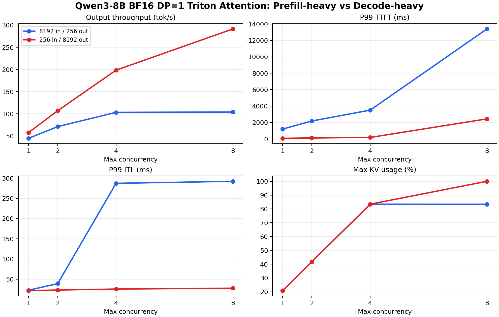

# Triton Attention Decode-Heavy Baseline

## Purpose

This experiment adds a decode-heavy BF16 baseline under the fixed `TRITON_ATTN` backend.

It is intentionally symmetric with the long-context prefill-heavy branch:

```text
Prefill-heavy: 8192 input / 256 output
Decode-heavy:   256 input / 8192 output
```

This separates two different serving pressure patterns:

- Long prompt, short decode: prefill/admission heavy.
- Short prompt, long decode: decode residency and KV growth heavy.

## Setup

| Item | Value |
|---|---|
| Model | `Qwen3-8B` |
| GPU | single `NVIDIA GeForce RTX 4090` |
| Serving stack | `vLLM` |
| Parallelism | `TP=1`, `DP=1` |
| dtype | `bfloat16` |
| Attention backend | `TRITON_ATTN` |
| KV cache dtype | default |
| Prompt / output | `256 / 8192` tokens |
| Prompts | `64` |
| Arrival | burst, `request_rate=inf` |
| Max concurrency | `1 / 2 / 4 / 8` |
| Seed / temperature | `42 / 0` |

Command:

```bash
MODEL_CONFIG=configs/qwen3_8b_dense_triton_attn.yaml \
RESULT_DIR=results/tables/Qwen3-8B/baseline_a_dp1_triton_attn_short_prompt_long_output \
CONCURRENCIES="1 2 4 8" \
RANDOM_INPUT_LEN=256 \
RANDOM_OUTPUT_LEN=8192 \
NUM_PROMPTS=64 \
SEED=42 \
TEMPERATURE=0 \
bash scripts/run_vllm_bench_concurrency.sh
```

## Decode-Heavy Results

| Max concurrency | Output tok/s | Req/s | P99 TTFT ms | P99 ITL ms | P99 TPOT ms | P99 E2EL | Max KV usage % | Max running/waiting |
|---:|---:|---:|---:|---:|---:|---:|---:|---:|
| 1 | 57.58 | 0.0070 | 70.97 | 21.75 | 17.37 | 142.3s | 20.82 | 1 / 0 |
| 2 | 107.03 | 0.0131 | 115.34 | 23.33 | 18.69 | 153.1s | 41.72 | 2 / 0 |
| 4 | 198.52 | 0.0242 | 175.43 | 25.72 | 20.14 | 165.1s | 83.45 | 4 / 0 |
| 8 | 291.32 | 0.0356 | 2439.75 | 27.86 | 30.77 | 252.3s | 100.00 | 8 / 6 |



## Prefill-Heavy vs Decode-Heavy

| Max concurrency | Prefill-heavy out tok/s | Decode-heavy out tok/s | Prefill-heavy P99 TTFT ms | Decode-heavy P99 TTFT ms | Prefill-heavy P99 ITL ms | Decode-heavy P99 ITL ms |
|---:|---:|---:|---:|---:|---:|---:|
| 1 | 44.74 | 57.58 | 1198.98 | 70.97 | 22.81 | 21.75 |
| 2 | 71.14 | 107.03 | 2182.62 | 115.34 | 39.10 | 23.33 |
| 4 | 103.33 | 198.52 | 3506.05 | 175.43 | 287.38 | 25.72 |
| 8 | 104.09 | 291.32 | 13395.54 | 2439.75 | 292.31 | 27.86 |

## Observations

- Decode-heavy c=1 to c=4 has very low TTFT because the prompt is short (`256` tokens).
- Output throughput scales from `57.58 tok/s` at c=1 to `291.32 tok/s` at c=8.
- P99 ITL stays moderate through c=8 (`21.75 ms` to `27.86 ms`), so token intervals remain much healthier than the prefill-heavy case.
- c=8 reaches `100%` KV usage and `6` waiting requests. The TTFT spike to `2439.75 ms` is therefore mostly an admission/KV-capacity effect: long decode requests keep KV blocks resident for a long time, so new requests wait even though their prompt is short.
- P99 E2EL is huge by construction because each request generates `8192` tokens.

## Interpretation

This case shows a different bottleneck from long-context prefill:

```text
Prefill-heavy: TTFT is dominated by long prompt prefill and scheduler admission.
Decode-heavy: TTFT is initially small, but high concurrency fills KV cache because each request remains active for thousands of decode steps.
```

The c=8 behavior is important for the next experiments:

- KV FP8 should help this case by increasing KV block capacity.
- AWQ should help decode throughput by reducing weight bandwidth per decode step.
- Scheduler effects must still be tracked, because long decode requests hold residency for a long time.

## Artifacts

- Raw benchmark JSON/log/dmon/metrics files: `results/tables/Qwen3-8B/baseline_a_dp1_triton_attn_short_prompt_long_output/`
- Summary JSON: `benchmark/projects/qwen3_8b_dense/data/triton_attn_prefill_vs_decode_heavy.json`
- Figure: `benchmark/projects/qwen3_8b_dense/assets/triton_attn_prefill_vs_decode_heavy.png`
